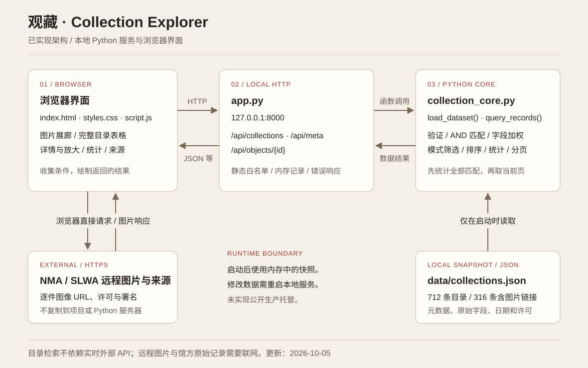
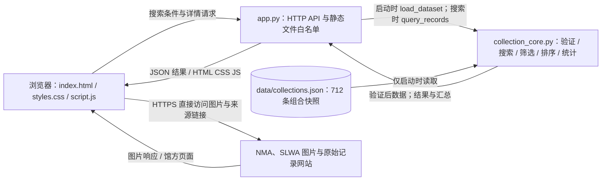

# 架构与数据流

应用由浏览器界面、本地 Python HTTP 服务、计算模块和本地 JSON 快照组成。NMA 与 SLWA 图片是浏览器直接访问的外部资源，不经过 Python 下载或缓存；启动、目录搜索和统计不依赖实时外部 API。

## 启动与请求

1. `app.py` 调用 `load_dataset()`，从本地 JSON 读取 `metadata` 和 `records`。验证字符串字段、列表、整数或空年份、日期区间和唯一 ID。数据错误时不启动服务。
2. 验证后的记录留在内存中。`app.py` 建立 ID 到记录的索引，并提供本地 `127.0.0.1:8000` 服务。此时无需访问外部 API。
3. 浏览器加载 HTML、CSS、JavaScript；取得 `/api/meta`，再请求 `/api/collections`。默认发送 `image_only=true`，因此图片展廊显示 API 快照中全部 316 条有图记录。
4. `collection_core.py` 验证参数，按模式和条件筛选，计算逐词权重、排序、对全部匹配记录统计，再分页。返回结果中的下拉选项始终取自全部 712 条记录。切换完整目录发送 `image_only=false`，浏览器用表格展示。
5. 详情调用 `/api/objects/{id}`。统计页复用最近一次成功检索的汇总，不额外把当前页当作总体。图像标签直接使用该记录的馆方 URL；放大图也由浏览器直接加载。

## API 与责任

| 路由 | 响应与职责 |
| --- | --- |
| `GET /api/meta` | 快照元数据及 `count`；由服务提供 |
| `GET /api/collections` | `items`、`total`、`page`、`page_size`、`pages`、`stats`、`facets`；计算由核心模块完成 |
| `GET /api/objects/{id}` | 一条原始记录；不存在时为 JSON 404 |

检索参数为 `q`、`category`、`material`、`place`、`year_start`、`year_end`、`sort`、`page`、`page_size`、`image_only`。网页每页 12 条，API 允许每页 1–50 条。`stats` 包含总数、已知和未知年份数、类别计数、十年区间计数；类别和年代条目为 `{label, count}`。非法输入返回 JSON 400，服务异常返回通用 JSON 500。

页面负责表单、导航、详情、图表和错误反馈；Python 负责数据读取和主要计算。数据文件启动后不再按请求读取，也没有写入接口，因此修改 JSON 后必须重启。`description` 保留源值但当前详情页不展示它；`image_large_url` 用于有图记录的放大查看。

## 边界与部署

- 静态服务仅允许页面文件和指定图片／字体资产，不允许直接下载 Python 源码、数据文件或列出目录；路径遍历和符号链接被拦截。
- 页面使用文本节点展示目录字段，外部链接限制为 HTTPS。应用不实现账户、上传、数据库或个人资料收集。
- 断网不影响快照检索；图片和馆方原始页面需要网络，图片失败时显示提示。快照需单独维护，不能视为馆方实时完整目录。
- 当前使用 Python 标准库演示服务器，没有生产托管、容器、反向代理或 Sites Workers 服务。公开部署须另行选择 Python 运行环境或适配方案、检查运行配置，并复核数据使用要求；本图只描述已实现的本地应用。
